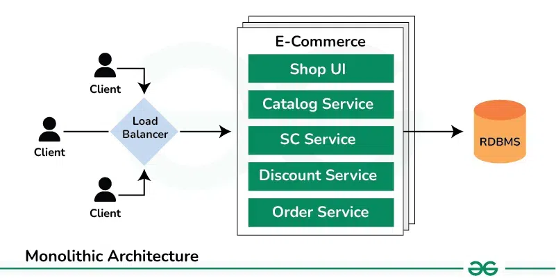
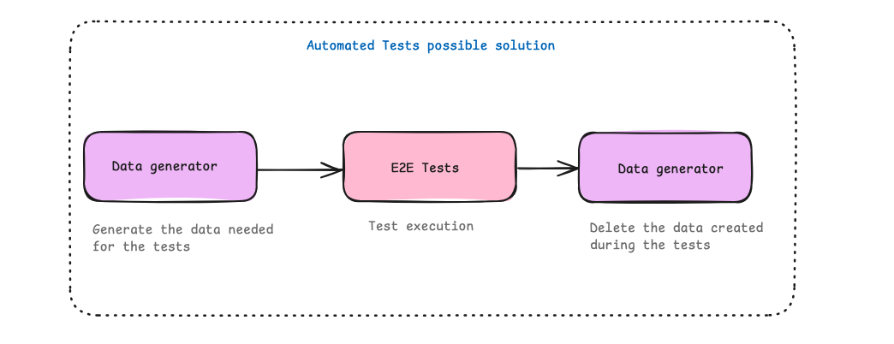

    <h1>
        🧱 Monolithic Architecture
    </h1>
    
    
    

---

## 📍 Definition

In software development, a monolitch architecture model is one where one single codebase executes multiple business function. The components of the application in this model should be present to be executed or compiled and for the software works. Due the features been tightly coupled and several functions are part of a single application, this architecture is usually very complex. 

> Monolithic architecture in software often requires a whole application to be recompiled even if only one part is changed 

## 🛠️ How it works

How in the monolithic all the code for the application is kept in one location, the development process like DevOps is easier to be executed. 

### Components

- Client-side interface(UI): What is going to be displayed to the final user. 
- Database: relational database 
- Server-side application: Deals with server resources like memory, CPU and storage
- Authentication

| Pros ⭐️                                                               | Cons ❌                                                                 |
|----------------------------------------------------------------------|------------------------------------------------------------------------|
| Easier application development and simple deployment                 | Difficult to integrate new technologies                                |
| Testing and debugging are less intensive                  | Scalability - small changes could demand some rebuild, which is time-consuming and labor-intensive |
| Security - As it is a closed system, data processes are fully contained |                                                                        |

## 📝 QA notes about this architecture

Considering the main characteristics about this architecture mode, there's some impacts that could affect the quality of what is developed:

- If the scope isn't well defined, it could lead to misunderstanding of the business rules, and high rework during validation phase due bugs.
- Some bugs could be so critical that could stop all the testing execution and consequently have delays of the project.

Is important to mention that, when we work in this type of architecture, the QA can work in two different ways:

- **Validate for every new feature added**: in small teams, this could be the best approach. The main issue in this process is that regressions will be needed for each deploy. So if the deploys are done each week, the QA or Tester will need to do regressions each week - Automation will be a good ally in this.

- **Validate only when a full package is done**: The approach is similar, but won't be deploys each week, it can take more time. In this way, the QA team should be engaged to already have the automation working and giving good results to reduce the time of regression on main functionalities that shouldn't be impacted and focus on the new ones. 

> To make it works is important to have a closed scope or the project don't pass through a massive changes. Because it will demands more regressions and high effort to mantain automated tests. 

For this type of architecture, is important to have a good scope of what is going to be automated. It can use different layers of test pyramid, but it will depends on the context. 

> When automating for projects like this, the e2e should be focused on the main core, in what is going to impact the business, so they can provide quick results when running.

Considering this type of architecture, we can think in a possible sequence to run automated tests: 

Before running the tests, I have one step before, that will be responsible to create the data needed for it.
**Why I made this?** Basically, to have separate contexts and avoid have E2E tests that will take a lot of time to be executed because they need to generate data before each test execution.

I decided this example based on what I've experienced. When we need to generate different datas and in a high ammount, it could lead a errors and make all the tests fail. 
In this way, is possible to make sure that the tests will only run when they have all the data needed and if one of them fail, is related to the feature itself, not the mismatch of data. 

> Is important for it have an secure way to add data to the database and the queries used to do it, be performatic

After the tests runs, will have another step to delete the data created, to keep the base on the environment where it will be executed clean. 

Some cons on this, is the mantainence of the projects, basically will be two projects to mantain updated. But considering that projects that use this architecture don't pass through a lot of changes, the risk is minor.

How this tests will be executed will depend on the team. It can run after each deploy of the solution, or have a cron job to execute every day, or every hour or even manually.

## Ref
- https://www.ibm.com/think/topics/monolithic-architecture
- https://www.techtarget.com/whatis/definition/monolithic-architecture